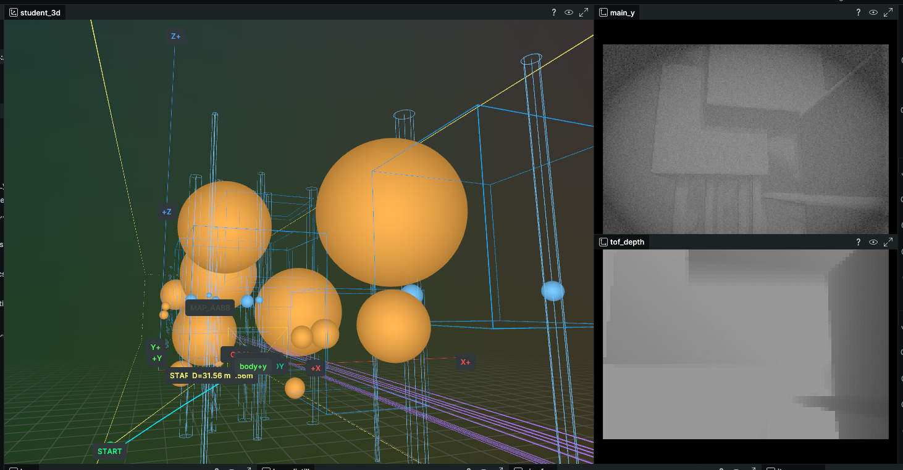

# DiffPhysDrone — Differentiable Perception Extension

> Built upon **[DiffPhysDrone](https://github.com/HenryHuYu/DiffPhysDrone)** (*Learning Vision-based Agile Flight via Differentiable Physics*, Nature Machine Intelligence 2025).  
> This repository extends the original differentiable physics simulator with a **Differentiable Perception** (可微感知) module, making the entire sensing-to-control pipeline end-to-end differentiable.

---

## Overview

The original DiffPhysDrone provides a CUDA-accelerated differentiable physics engine for agile drone flight. This fork goes one layer deeper and wraps the sensor stack in fully differentiable PyTorch operators, so **gradients can flow from the loss all the way back through the sensor parameters** — just as they flow through the physics.

Currently implemented differentiable sensors:

| Sensor | Parameters Differentiable via Backprop |
|---|---|
| **Differentiable RGB Camera** (可微普通相机) | FOV, Exposure, ISO/Gain |
| **Differentiable Active ToF Camera** (可微深度相机) | Transmit Power, Exposure time, Receiver Gain |

Policy-controlled sensor parameters are **3D** in current code (no focus head):

| `sensor_mode` | Policy output channels (1,2,3) | Physical meaning |
|---|---|---|
| `camera_luma_plus_depth` / `camera_luma` | `(fov, exposure, iso)` | 主相机视场、曝光、增益 |
| `active_depth` | `(power, exposure, gain)` | 主动深度发射功率、曝光、接收增益 |

More sensor types and models are planned for future releases.


---

## Visualization

The image below shows a live training session visualised with [Rerun](https://rerun.io). The left panel shows the 3-D scene with obstacles (orange spheres), the drone trajectory (yellow), and the AABB collision field. The right top panel (`main_y`) shows the grayscale luminance channel rendered by the **differentiable RGB camera**. The right bottom panel (`tof_depth`) shows the depth map rendered by the **differentiable Active ToF camera**.



> **Note**: Save the screenshot to `assets/visualization.png` in the repository root.

---

## Differentiable Sensor Design

### 1. Differentiable RGB Camera

The depth-aligned camera renders a grayscale luminance image (`Y` channel) through a **multi-layer differentiable photometric pipeline**:

1. **Geometry** — depth + approximate surface normals from Sobel derivatives
2. **Lighting** — ambient + directional light, distance attenuation, shadow approximation
3. **Reflectance** — Lambert diffuse + optional specular (material-class priors per object type)
4. **Lens** — vignetting, PSF blur (σ linked to focus/motion state), optional radial distortion and flare
5. **Sensor** — exposure integration, shot/read noise (Poisson–Gaussian approximation), PRNU/DSNU pattern
6. **ISP** — black-level correction, gain, tone-mapping (Reinhard / softplus), gamma, optional sharpening
7. **Temporal AE** — auto-exposure state-machine with PI controller tracking a target luminance

Camera/sensor control parameters are 3D and are predicted with `--camera_action_mode absolute` or `--camera_action_mode incremental`:

- `absolute`: 输出绝对值（`[0,1]` 域）
- `incremental`: 输出增量（`[-1,1]` 域），按 `--cam_delta_scale` 累积更新

CUDA-backed differentiable FOV rendering is provided via `DiffRenderFunction` (wrapping `quadsim_cuda.render_diff_fov`).

**Camera-related loss terms** (active when `--camera_action_mode` is not `off`):

| Loss | Purpose |
|---|---|
| `loss_cam_smooth` | Penalises rapid parameter changes between time-steps |
| `loss_fov_reg` | Soft-anchors the first control channel near default (`camera_luma*`: FOV; `active_depth`: power) |
| `loss_cam_range` | Keeps all parameters near the sigmoid centre to prevent gradient vanishing |
| `loss_blur` | Penalises motion blur: $\mathcal{L}_{blur} \propto \|v\| \cdot t_{exp}$ |
| `loss_noise` | Penalises sensor noise amplification at high ISO / low exposure |

Enable the full optical-loss set with `--enable_camera_quality_loss`.

---

### 2. Differentiable Active ToF Camera

The active Time-of-Flight sensor models the full **optical energy chain** in a differentiable manner, enabling the policy to learn *when* to emit light and *how much energy* to spend.

**Physical model:**

$$E_{recv} \propto \frac{P \cdot t_{exp} \cdot g}{D^2 + \epsilon}$$

$$C = \tanh\!\left(\alpha \cdot E_{recv}\right), \qquad \sigma_{noise}^2 \propto \frac{1}{E_{recv}}$$

| Symbol | Meaning |
|---|---|
| $P$ | Transmit power |
| $t_{exp}$ | Exposure time |
| $g$ | Receiver gain |
| $D$ | Per-pixel geometric depth |
| $C$ | Depth confidence map (output alongside depth) |

Additional physical effects modelled:

- **Motion blur** penalty: $\text{Blur} \propto \|v\| \cdot t_{exp}$ — the policy learns to shorten exposure at high speed.
- **Reparameterised noise injection**: gradients flow through the stochastic depth noise via a Gaussian reparameterisation of the Poisson process.
- Active ToF depth is used directly as policy input (single depth channel).

Both a pure **PyTorch backend** (`active_depth=python`) and a custom **CUDA kernel** (`active_depth=cuda`) are available, selectable per-sensor via `--diff_sensor_impl`.

---

## Quick Demos (from Original DiffPhysDrone)

### Single Agent Flights
<table>
  <tr>
    <td></td>
    <td></td>
  </tr>
</table>

### Swarm Tasks
<table>
  <tr>
    <td></td>
    <td></td>
  </tr>
</table>

---

## Environment Setup

### Python Environment

Tested with:

| Dependency | Version |
|---|---|
| Python | 3.9 / 3.11 |
| PyTorch | 2.2.2 |
| CUDA | 11.8 |

Other recent PyTorch + CUDA combinations should also work.

### Build CUDA Ops

To build the CUDA operations, run the following command:

```bash
pip install -e src
```

---

## Training

### Paper Full Config (Active ToF + Unified Control)

```bash
python main_cuda.py $(cat configs/paper_final_full.args)
```

### Multi-agent / Single-agent Quick Start

```bash
# For multi-agent
python main_cuda.py $(cat configs/multi_agent.args)
# For single-agent
python main_cuda.py $(cat configs/single_agent.args)
```

### Key Training Flags

| Flag | Description |
|---|---|
| `--sensor_mode active_depth` | Use differentiable active-depth sensor only |
| `--sensor_mode camera_luma_plus_depth` | Dual-encoder: camera luma + depth |
| `--sensor_mode camera_luma` | Camera luma only |
| `--sensor_mode depth` | Depth only |
| `--camera_action_mode incremental` | Camera parameters as part of the action space |
| `--enable_camera_quality_loss` | Enable blur & noise perception losses |
| `--diff_sensor_impl camera_luma=python active_depth=cuda` | Per-sensor backend selection |
| `--cam_realism_preset high` | Photometric pipeline quality (`low/medium/high/ultra`) |
| `--tbptt_enable` | Truncated BPTT for long-horizon training |
| `--hybrid_full_bptt_every N` | Interleave full BPTT every N iters for long-range calibration |
| `--resume <ckpt>` | Resume from a checkpoint |

A fully-annotated configuration covering all available parameters is in [`configs/paper_final_full.args`](configs/paper_final_full.args).

---

## Active ToF Gradient Consistency Check

To verify that the Python and CUDA Active ToF implementations produce consistent gradients for `power`, `exposure`, and `gain`:

```bash
python tools/compare_active_tof_gradients.py --loss_mode conf
```

Options:

- `--loss_mode conf` — stable mode, no stochastic noise in the loss path (recommended)
- `--loss_mode both` — closer to training loss, but higher variance due to stochastic noise
- `--batch_size 4` — batch size for the comparison

The script reports **cosine similarity** and **relative L2 error** between the Python and CUDA gradient paths.

---

## Live Visualisation

Enable real-time visualisation during training with [Rerun](https://rerun.io):

```bash
python main_cuda.py $(cat configs/paper_final_full.args) \
    --vis_enable --vis_backend rerun --vis_spawn
```

The viewer shows:
- `student_3d` — 3-D world with obstacles, drone body frame, and full trajectory
- `main_y` — RGB camera luminance output (grayscale)
- `tof_depth` — Active ToF depth map

Replay a saved recording:

```bash
python rerun_vis.py
```

---

## Evaluation

Download the simulation validation environment from the original [DiffPhysDrone releases page](https://github.com/HenryHuYu/DiffPhysDrone).

Launch the simulator:

```bash
cd <path to multi-agent code supplementary>
./LinuxNoEditor/Blocks.sh -ResX=896 -ResY=504 -windowed -WinX=512 -WinY=304 \
    -settings=$PWD/settings.json
```

Evaluate a trained checkpoint:

```bash
python eval.py --resume <path to checkpoint> --target_speed 2.5
```

---

## Repository Structure

```
.
├── env_cuda.py            # Differentiable environment: physics + all sensor renderers
│                          #   DiffRenderFunction      — differentiable FOV rendering
│                          #   DiffRenderActiveTofFunction — differentiable Active ToF
│                          #   render_active_tof_diff  — Python / CUDA dispatch
├── model.py               # Policy network (CNN stem + GRU + multi-head output)
│                          #   sensor_mode: depth / camera_luma / camera_luma_plus_depth / diff_depth
├── main_cuda.py           # Training loop (BPTT / TBPTT / hybrid + teacher-student)
├── lqr.py                 # Differentiable LQR / dMPC solver
├── rerun_vis.py           # Rerun visualisation helper
├── configs/
│   ├── paper_final_full.args     # Full paper config (Active ToF + unified control)
│   ├── paper_ablate_rgb_only.args
│   ├── paper_ablate_tof_only_intent_lqr.args
│   └── ...               # Other ablation / task configs
├── src/                   # CUDA extension
│   ├── quadsim_kernel.cu  # Physics forward + rendering kernels
│   ├── dynamics_kernel.cu # Quadrotor dynamics backward pass
│   └── setup.py
└── tools/
    └── compare_active_tof_gradients.py  # Python vs CUDA gradient sanity check
```

---

## Roadmap

- [x] Differentiable RGB camera (FOV / exposure / ISO / focus)
- [x] Differentiable Active ToF camera (power / exposure / gain / confidence)
- [x] Multi-layer high-fidelity photometric pipeline (shadow, fog, vignetting, AE)
- [x] CUDA kernel for Active ToF backward pass
- [ ] Differentiable LiDAR / radar sensor model
- [ ] Differentiable event camera model
- [ ] More real sensor noise profiles (e.g., Sony IMX279, Intel RealSense D455)

---

## Citation

If you use this repository or the underlying physics engine, please cite the original paper:

```bibtex
@article{zhang2025learning,
  title={Learning vision-based agile flight via differentiable physics},
  author={Zhang, Yuang and Hu, Yu and Song, Yunlong and Zou, Danping and Lin, Weiyao},
  journal={Nature Machine Intelligence},
  pages={1--13},
  year={2025},
  publisher={Nature Publishing Group}
}
```
