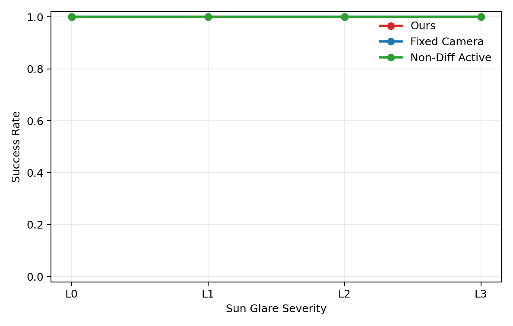
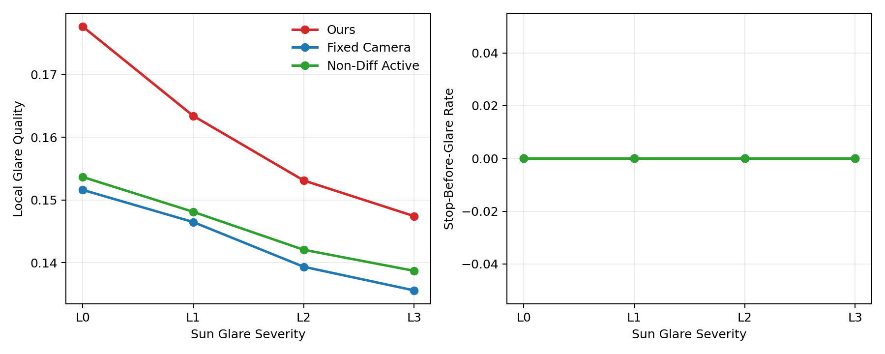
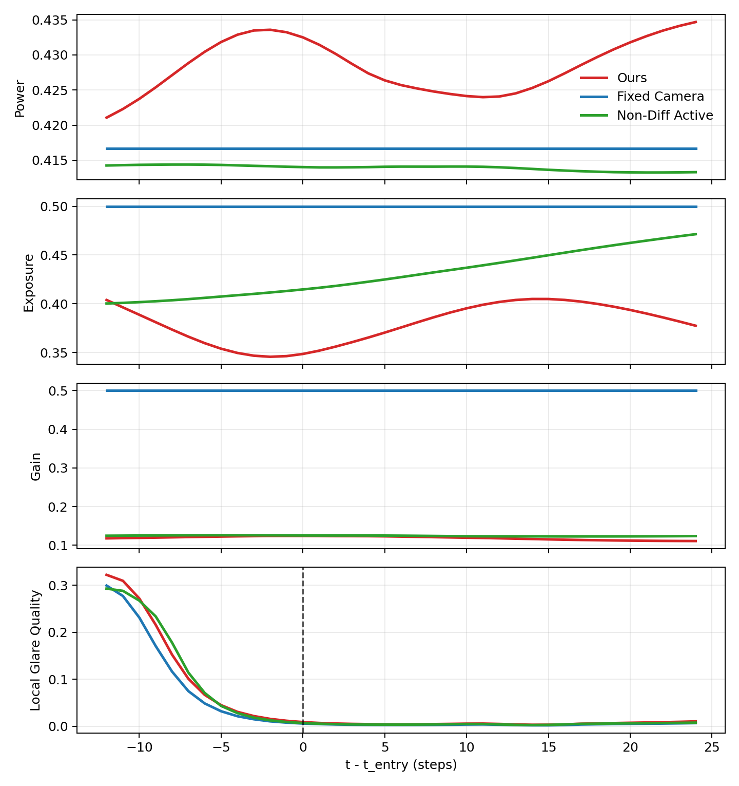
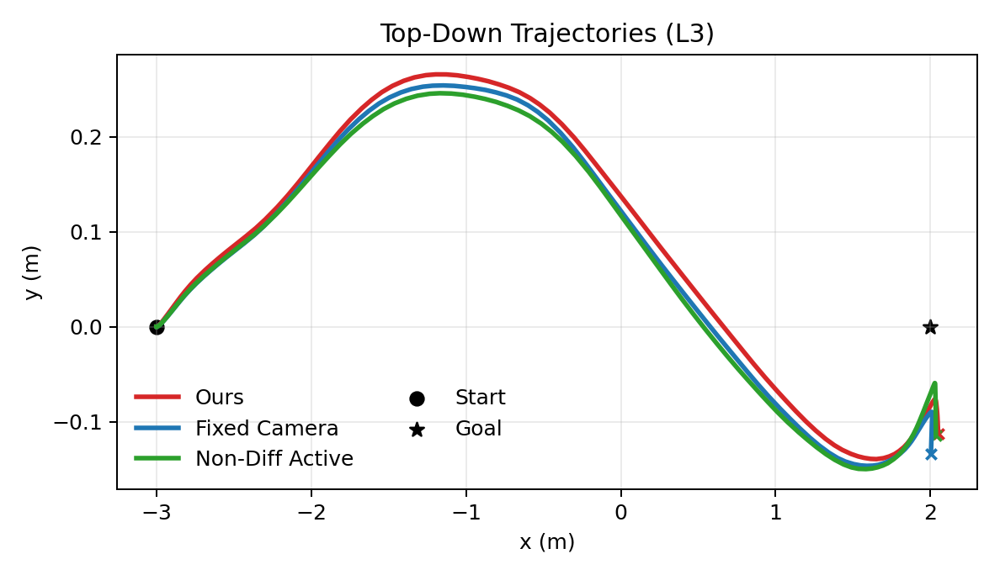

# RAL 实验结果报告

结果目录：`/home/zhaoguodong/work/code/DiffPhysDrone/paper/experiment/results/results_2026-04-22-16-15-42`

## 文件说明

- `summary_metrics.csv`：每个方法、每个场景条件的一行汇总结果。
- `episode_metrics.csv`：每个 episode 一行，可看波动和失败模式。
- `trace_metrics.csv`：每个 timestep 一行，可画事件对齐曲线。
- `success_vs_glare.png`：随 glare 强度变化的成功率曲线。
- `quality_and_stop_vs_glare.png`：局部质量和保守停车曲线。
- `event_aligned_l3.png`：L3 条件下的参数时序图。
- `trajectory_l3.png`：L3 条件下的顶视轨迹图。

## 当前结果一眼结论

- `Base` 场景下当前最好的方法是 `Non-Diff Active`，成功率约为 `0.445`。
- 但 `Base` 场景三种方法的成功率都偏低，说明当前基础导航本身还不够稳定，这会削弱论文里关于 `sun_glare` 的结论可信度。
- `Sun Glare` 四档强度下三种方法当前全部 `100% success`，说明这个逆光任务目前已经饱和，主结果表上很难再用 `success rate` 拉开差距。
- 在这种情况下，更该关注 `local_glare_quality`、`local_glare_invalid_rate`、`power/exposure/gain` 以及事件对齐曲线，而不是只看成功率。
- 当前所有 glare 条件里，`local_glare_quality` 最高的单项结果来自 `Ours` @ `sun_glare_l0`，数值约为 `0.178`。

## Base 场景汇总

| Method | Success | Collision | Time | AvgSpeed | Fill |
|---|---:|---:|---:|---:|---:|
| Fixed Camera | 0.380 | 0.620 | 8.000 | 0.416 | 0.449 |
| Non-Diff Active | 0.445 | 0.555 | 8.000 | 0.436 | 0.441 |
| Ours | 0.370 | 0.630 | 8.000 | 0.440 | 0.439 |

## Sun Glare 汇总

| Method | Level | Success | Time | LocalQ | LocalInv | Power | Exposure | Gain |
|---|---|---:|---:|---:|---:|---:|---:|---:|
| Ours | L0 | 1.000 | 5.350 | 0.178 | 0.745 | 0.432 | 0.375 | 0.121 |
| Fixed Camera | L0 | 1.000 | 5.403 | 0.152 | 0.771 | 0.417 | 0.500 | 0.500 |
| Non-Diff Active | L0 | 1.000 | 5.237 | 0.154 | 0.776 | 0.414 | 0.452 | 0.127 |
| Ours | L1 | 1.000 | 5.393 | 0.163 | 0.773 | 0.429 | 0.384 | 0.122 |
| Fixed Camera | L1 | 1.000 | 5.447 | 0.146 | 0.786 | 0.417 | 0.500 | 0.500 |
| Non-Diff Active | L1 | 1.000 | 5.280 | 0.148 | 0.792 | 0.414 | 0.452 | 0.127 |
| Ours | L2 | 1.000 | 5.350 | 0.153 | 0.790 | 0.427 | 0.391 | 0.122 |
| Fixed Camera | L2 | 1.000 | 5.420 | 0.139 | 0.799 | 0.417 | 0.500 | 0.500 |
| Non-Diff Active | L2 | 1.000 | 5.250 | 0.142 | 0.803 | 0.414 | 0.452 | 0.127 |
| Ours | L3 | 1.000 | 5.323 | 0.147 | 0.803 | 0.426 | 0.397 | 0.122 |
| Fixed Camera | L3 | 1.000 | 5.390 | 0.136 | 0.809 | 0.417 | 0.500 | 0.500 |
| Non-Diff Active | L3 | 1.000 | 5.227 | 0.139 | 0.814 | 0.414 | 0.452 | 0.127 |

## 怎么分析这些指标

- `success_rate / collision_rate`：决定任务是否完成，但一旦全部饱和就不再有区分度。
- `local_glare_quality`：最关键的感知恢复指标，越高越说明逆光区域还保留了可用几何。
- `local_glare_invalid_rate`：越低越好，说明炫光区域里无效深度更少。
- `power_mean / exposure_mean / gain_mean`：用于解释策略是如何恢复感知的。
- `time_to_goal`：如果成功率都一样，它能反映谁更保守、谁更果断。

## 自动诊断建议

- `Base` 成功率太低：建议先提高基础避障稳定性，否则 reviewer 会质疑 glare 结论是否建立在不稳定导航之上。
- `Sun Glare` 成功率完全饱和：建议把 `L3` 再做难一点，或者增加更严格的局部感知指标。
- 在 `L3` 下，`Ours` 相对 `Fixed Camera` 的 `LocalQ` 提升约 `0.012`，`Power` 提升约 `0.009`，这正是论文里最值得讲的机制证据。

## 可直接引用的图片

